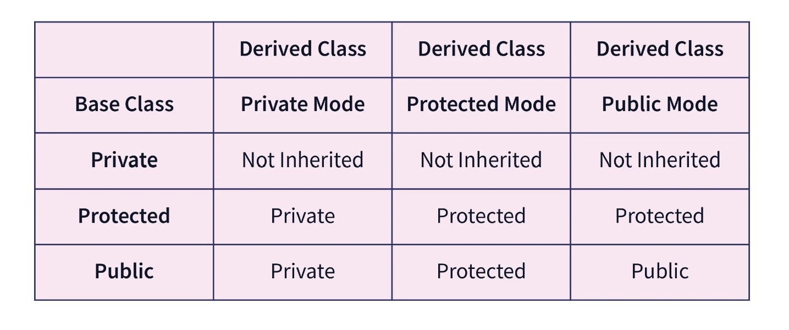
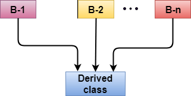
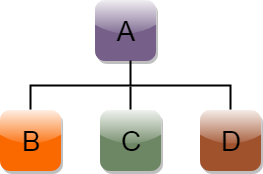
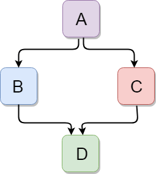

# OOPs

## Abstraction

Hiding internal implementation and showing only required featues

## Encapsulation

The binding of data and attributes or methods and data members in single unit.

Encapsulation = Data Hiding + Abstraction.

* [ ] Access modifier : private, public, protected

## Inheritance

The method of accuiring features of existing class into the new class.

```cpp
class <subclass-class> : <access-modifier> <base-class>
{
    // subclass code
}
```


Types of Inheritance

1. Single Inheritance : A class allowd to inherit from only one class.
   
2. Multiple Inheritance : A class can inherit from more than one class.
   
3. Multilevel Inheritance : A class can be inherit from another derived classs that derived class can be inherited from another derived or base class. (There can be any number of levels)
   
4. Hierarchical Inheritance : More than one subclass created from single base class.
   
5. Hybrid Inheritance : combining more than one type of inheritance.
   

## Polymorphism : Many forms

One object can work defferently based on binded object

```cpp
// santax
Base* obj = new derived(); // obj type is Base* but morphs/work as Derived binded object.
```

**Abstract and Encapsulation go hand in hand similarly Inheritance and Polymorphism go hand in hand.**
