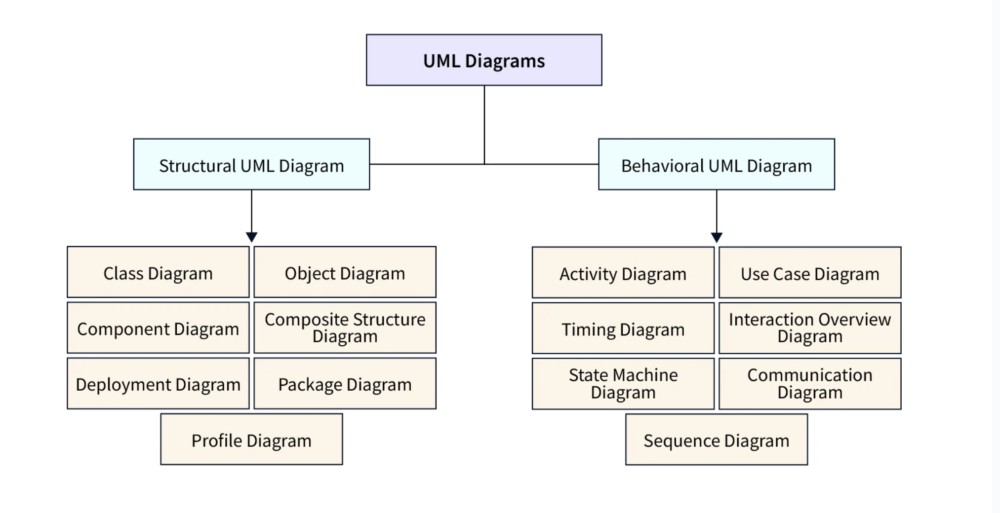

# LLD

* UML Diagram
* OOPs Principle
* SOLID Principle
* Design Patterns

## UML Diagram - 14 Types

During SDLC below 4 Diagrams are most important

* Class Diagram
* Use Case Diagram
* State Diagram
* Sequence Diagram

## OOPs Principle

* Encapsulation
* Abstraction
* Inheritance
* Polymorphism

## SOLID Principle

* Single Responsibility Principle
* Open-Closed Principle
* Liskov Substitution principle
* Interface Segration Principle
* Dependecy Inversion Principle

## Design Patterns - 23 Types
