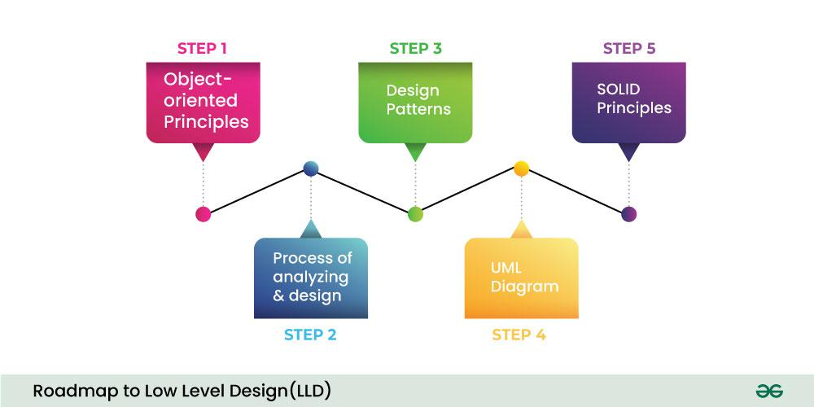
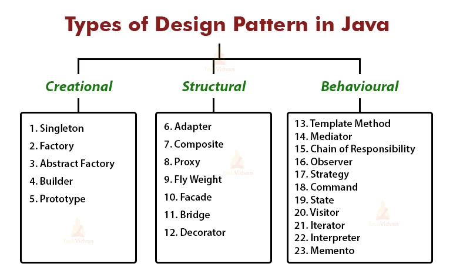
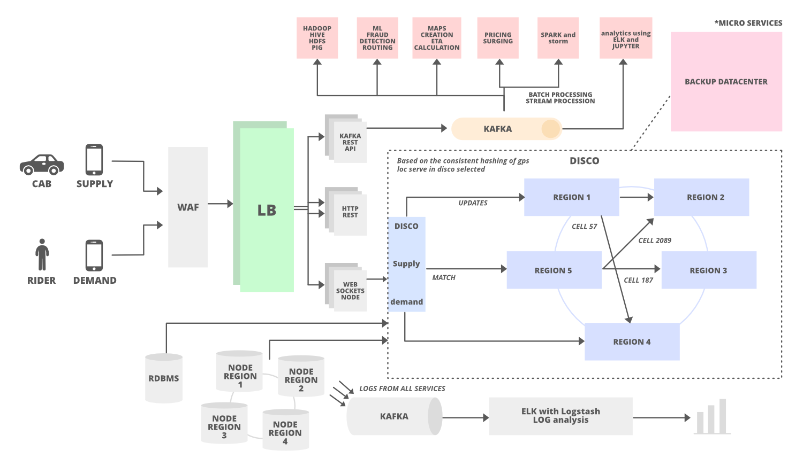

# System Design

*System Design* is the process of designing the architecture, components, and interfaces for a system so that it meets the end-user requirements.

[Theory.](https://github.com/karanpratapsingh/system-design)

## LLD

Low level design : It focus on implementation of indivisual components of HLD.

### OOPs Principle

* Encapsulation
* Abstraction
* Inheritance
* Polymorphism

### UML Diagram

* Class Diagram
* Use Case Diagram
* State Diagram
* Sequence Diagram

### SOLID

* Single Responsibilty Principle
* Open-Closed Principle
* Liskov Substitution Principle
* Interface Segration Principle
* Dependecy Inversion Principle

### [Design Patterns ](https://refactoring.guru/design-patterns/cpp)

* [ ] Creational
  * [ ] Singleton
  * [ ] Factory Method
  * [ ] Abstract Factory
  * [ ] Builder
  * [ ] Prototype
  * [ ] Dependecy Injection
* [ ] Structure
  * [ ] Adapter
  * [ ] Composite
  * [ ] Proxy
  * [ ] Flyweight
  * [ ] Facade
  * [ ] Bridge
  * [ ] Decorator
* [ ] Behavioural
  * [ ] Template Method
  * [ ] Mediator
  * [ ] Chain of Responsibility
  * [ ] Observer
  * [ ] Strategy
  * [ ] Command
  * [ ] State
  * [ ] Visitor
  * [ ] Iterator
  * [ ] Interpretor
  * [ ] Memento

## HLD

High level design

## Extra
